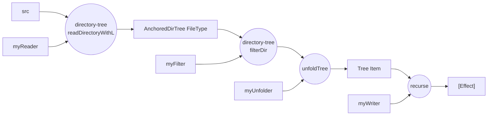

This is a Haskell script that transforms the resources from [ingun37/answers-db](https://github.com/ingun37/answers-db) into the static assets for the website [ingun37/answers](https://github.com/ingun37/answers). The nix build cache is pushed to the `inguncache` Cachix in the CI/CD here, and pulled from the CI/CD of the **answers** web app. Check out the github workflow files of both projects for the details.

# Build manually on MacOS

```sh
# for building gitlib packages 
brew install pkgconf
brew install icu4c
brew install openssl@3

# /usr/local/opt/openssl is hard coded in the gitlib build setting.
ln -s $(brew --prefix openssl@3)/3.5.2 /usr/local/opt/openssl

echo "export PKG_CONFIG_PATH=\"$(brew --prefix)/opt/icu4c/lib/pkgconfig\"" >> ~/.zprofile
```

## Build
```sh
cabal build
```

## Run Unit test
```sh
cabal test
```

# Data flow



# CI/CD

## Update gitlib sha1

Check the sha1 of gitlib like this

```sh
nix-shell -p nix-prefetch-git
nix-prefetch-git https://github.com/jwiegley/gitlib.git bf256617179d853bdbc12e9283b3f570ebb9d9d7 --fetch-submodules
```

Output will look like this

```
git revision is bf256617179d853bdbc12e9283b3f570ebb9d9d7
path is /nix/store/63bx4k5nwjqwk7gv0a0k8adq796bjbpr-gitlib-bf25661
git human-readable version is -- none --
Commit date is 2025-09-04 11:17:27 -0700
hash is 13k3aymqwzpcijnjjka820nv6rkgakzbvh13glw98p1c4yhqwcbf
{
  "url": "https://github.com/jwiegley/gitlib.git",
  "rev": "bf256617179d853bdbc12e9283b3f570ebb9d9d7",
  "date": "2025-09-04T11:17:27-07:00",
  "path": "/nix/store/63bx4k5nwjqwk7gv0a0k8adq796bjbpr-gitlib-bf25661",
  "sha256": "13k3aymqwzpcijnjjka820nv6rkgakzbvh13glw98p1c4yhqwcbf",
  "hash": "sha256-bjGOoScsXJQ4fSPAvf5Ub2azLRBITSmtjOx+jqtXY44=",
  "fetchLFS": false,
  "fetchSubmodules": true,
  "deepClone": false,
  "fetchTags": false,
  "leaveDotGit": false,
  "rootDir": ""
}
```

Use the "sha256" for the `--sha256` field in the `cabal.project`.
