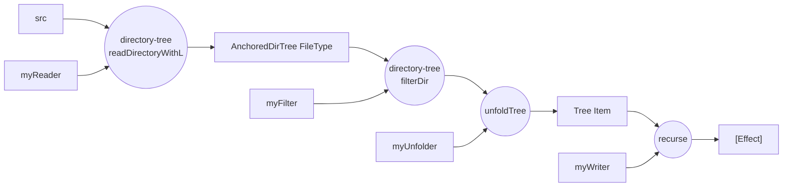

# Build MacOS

```sh
# for building gitlib packages 
brew install pkgconf
brew install icu4c
brew install openssl@3

# /usr/local/opt/openssl is hard coded in the gitlib build setting.
ln -s $(brew --prefix openssl@3)/3.5.2 /usr/local/opt/openssl

echo "export PKG_CONFIG_PATH=\"$(brew --prefix)/opt/icu4c/lib/pkgconfig\"" >> ~/.zprofile
```

```sh
cabal build
```

# Data flow

